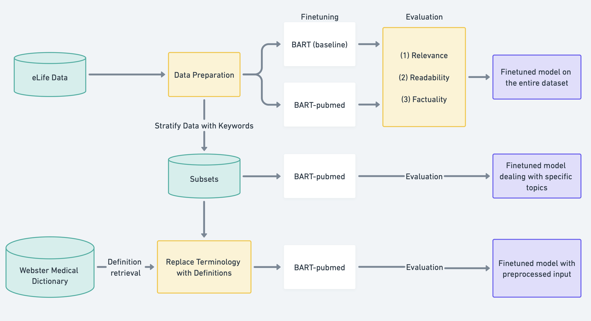

# BioLaySum Project
Shared Task: Lay Summarization of Biomedical Research Articles @ [BioNLP Workshop, ACL 2024](https://aclweb.org/aclwiki/BioNLP_Workshop) <br>
Contributors: [Xincheng Cai](https://github.com/Cyngua), [Mengmeng Du](https://github.com/dmm2001) <br>
Project Directory Tree:
.
└── BioLaySum-Project-2024/
    ├── Scripts/
    │   ├── modified_text.ipynb
    │   ├── train_entire_data.ipynb
    │   └── train_subsets.ipynb
    ├── BioNLP Project Paper
    ├── BioNLP Project Presentation
    ├── README.md
    ├── env.yml
    └── workflow.jpg

## Outline

1. [Abstract](#abstract)
2. [Project Workflow](#project-workflow)
3. [Environment Setup and Computing Infrastructure](#environment-setup-and-computing-infrastructure)
4. [Dataset Description](#dataset-description)
5. [Methods](#methods)
6. [Training Details](#training-details)
7. [Results](#results)
8. [Limitations and Conclusions](#limitations-and-conclusions)
9. [Main References](#main-references)


## Abstract
Biomedical research articles contain vital information for a wide audience, yet their complex language and specialized terminology often hinder comprehension for non-experts. Inspired by the BIONLP 2024 workshop, we propose a NLP solution to generate lay summaries, which are more readable to diverse audiences. We implemented two transformer-based models, specifically BART and BART-PubMed. Our study investigates the performance of these models across different biomedical topics and explores methods to improve summarization quality through definition retrieval from Webster Medical Dictionary. By enhancing the readability of biomedical publications, our work aims to promote knowledge accessibility to scientific information.

## Project Workflow
Our project mainly consist of three parts as shown in the workflow diagram:
* **Experiment I**: BART vs BART-PubMed on the entire dataset: Compared the finetuning performance on the test dataset using metrics from three aspects: relevance, readability and factuality. 
* **Experiemnt II**: BART-PubMed model across various topics: Finetune BART-PubMed model separately on 6 subsets of the dataset stratified by keywords. 
* **Experiment III**: Terminology replacement: To further enhance performance, we implemented terminology replacement with definitions retrieved from a medical dictionary, [Webster Medical Library](https://www.merriam-webster.com/medical), and evaluated its impact on model performance.


## Environment Setup and Computing Infrastructure
* Experiment I: We have a file called `env.yml` for virtual environment setup, which is provided by Yale CPSC452/552: Deep learning theory and application. The training process was run on the cpsc462 cluster [Yale McCleary](https://docs.ycrc.yale.edu/clusters/mccleary/), which supports `gpu_devel` with 6-core cpu (Pytorch CUDA version 11.8, torch version 2.2.2). Here is the code to create conda environment:

``` sh
# create conda environment
$ conda env create -f env.yml

# update conda environment
$ conda env update -n cpsc552 --file env.yml
```

* Experiment II and III: We based our last two experiments on Google Colab Pro environment plus external library installed. All the training was run on **T-4 GPU** by Google Colab (CUDA version 12.0, torch version 2.2.1+cu121). Run the following codes in colab notebooks to install the most essential libraries for this project.

```
!pip install accelerate -U
!pip install transformers datasets evaluate
!pip install textstat
!pip install rouge_score
!pip install bert_score
!pip install summac
!pip install requests beautifulsoup4
!pip install spacy
!python -m spacy download en_core_web_lg
```

## Dataset Description
[Link to the datasets](https://drive.google.com/drive/folders/1sfmYlHL9FcAjKpLzjW4CO_izJmVbcZ-g?usp=sharing), which is a google drive folder accessible to Yale community. We utilized eLife biomedical journals in this project, an open-access peer-reviewed journal with a specific focus on biomedical and life sciences. The original datasets are provided by the shared task in .jsonl format, where each line represents a JSON object with the fields outlined 

| Column       | Description            |
|--------------|------------------------|
| Lay summary  | Article lay summary   |
| Article      | Article main text      |
| Headings     | Article headings       |
| Keywords     | Topic of the article   |
| ID           | Article ID             |

The datasets have been pre-split for model training and validation, consisting of 4,346 instances earmarked for training and 241 for validation. The folder also contains the data modified with a definition replacement preprocessing step, and the data rearranged according to the keywords. All these modified datasets are in a json format.

## Methods
Please refer to our report methods section for further details about models and evaluation metrics.
### Models
* BART(Bidirectional and Auto-Regressive Transformers): a denoising autoencoder built upon a sequence-to-sequence architecture, pretrained on XSum news dataset. [Huggingface BART Documentation](https://huggingface.co/docs/transformers/v4.40.2/en/model_doc/bart#overview)
* BART-PubMed: BART based model, pretrained on the PubMed dataset. [Huggingface BART-PubMed](https://huggingface.co/mse30/bart-base-finetuned-pubmed)

### Evaluation Metrics
We evaluated our model performance from three perspectives: Relevance, Readability, and Factuality. The metrics are listed as follows:
|                 | Evaluation Metrics         |
|-----------------|----------------------------|
| **Relevance**   | ROUGE (1, 2, and L) and BERTScore |
| **Readability** | FKGL, CLI, DCRS            |
| **Factuality**  | SummaC                     |

## Training Details
We utilized `Trainer` for training ([Huggingface Trainer Documentation](https://huggingface.co/docs/transformers/en/main_classes/trainer)). It allows supports distributed training on multiple GPUs/TPUs and mixed precision, and it is optimized for Huggingface Transformers. The number of training epochs was set due to out limited training time and the model performance. Here is an example of our trainer initialization, which is consistent throughout our experiments.

```
from transformers import Trainer, TrainingArguments

training_args = TrainingArguments(
    output_dir='./results',          
    num_train_epochs=3,              # number training epochs is 3
    per_device_train_batch_size=8,   # training batch size is 8
    per_device_eval_batch_size=8,    # evaluation batch size is 8
    warmup_steps=100,                # warmupstep is 100
    weight_decay=0.01,               # weight decay parameter is 0.01
    logging_dir='./logs',            
    logging_steps=10,                
    evaluation_strategy="steps",     
    eval_steps=100,                  
    save_strategy="steps",           
    save_steps=500,                  
    fp16=True, # Enable mixed precision                      
)

trainer = Trainer(
    model=model,
    args=training_args,
    train_dataset=train_dataset,
    eval_dataset=val_dataset,
    compute_metrics=compute_metrics,
)

trainer.train()
```

## Results
Please refer to our report results section for further details about results and discussions. Here we only outline the tables of evaluation. <br>
**Experiment I**: BART vs BART-PubMed on the entire dataset

| Metric            | ROUGE-1 | ROUGE-2 | ROUGE-L | BERT-score | FKGL | CLI  | DCRS |
|-------------------|---------|---------|---------|------------|------|------|------|
| **BART**          | **57.82** | **22.44** | **54.16** | **86.93** | 9.17 | 10.62 | 8.97 |
| **BART-PubMed**   | 54.92   | 19.13   | 51.06   | 86.07      | **8.71** | **10.13** | **8.71** |

**Experiemnt II**: BART-PubMed model across various topics

| Domain                                | ROUGE-1 | ROUGE-2 | ROUGE-L | BERT-score |
|---------------------------------------|---------|---------|---------|------------|
| Biochemistry and Chemical Biology     | 52.62   | 16.54   | 49.15   | 85.57      |
| Cell Biology                          | 54.27   | 17.99   | 50.36   | **86.13**  |
| Developmental Biology                 | 54.30   | 18.88   | 50.38   | 86.08      |
| Microbiology and Infectious Disease   | 54.42   | 18.83   | 50.63   | 86.08      |
| Neuroscience                          | 55.40   | **19.85**| 51.57   | 86.05      |
| Structural Biology and Molecular Biophysics | **56.98** | 19.36 | **51.75** | 86.00 |

| Domain                                | FKGL   | CLI    | DCRS   | SummaC |
|---------------------------------------|--------|--------|--------|--------|
| Biochemistry and Chemical Biology     | 7.886  | 9.608  | 8.869  | 0.417  |
| Cell Biology                          | 8.863  | 10.473 | 8.825  | 0.417  |
| Developmental Biology                 | **8.233** | **9.324** | 8.530  | **0.450** |
| Microbiology and Infectious Disease   | 8.762  | 10.846 | 8.762  | 0.395  |
| Neuroscience                          | 8.658  | 10.360 | **8.503** | 0.431  |
| Structural Biology and Molecular Biophysics | 9.493 | 10.130 | 9.185  | 0.395  |

**Experiemnt III**: Terminology replacement

|               | ROUGE-1 | ROUGE-2 | ROUGE-L | Bert-score | FKGL  | CLI   | DCRS  | SummaC |
|---------------|---------|---------|---------|------------|-------|-------|-------|--------|
| w/o  replacement  | 53.805  | 16.223  | 49.575  | 85.433     | 8.667 | 9.924 | 8.851 | 41.403 |
| with  replacement  | **58.871** | **20.084** | **56.669** | 84.144     | **8.137** | **9.618** | **8.071** | 40.955 |

## Limitations and Conclusions
The objective of our project is to generate more readable summaries from biomedical research papers, thereby contributing to knowledge translation and effective communication within the scientific community. Our research results have highlighted the strength of BART-PubMed in generating more readable summaries and the potential for further improvement with an additional definition retrieval step in preprocessing. The limitation is that we only tested definition retrieval on one subset of data. Moving forward, we intend to apply the definition retrieval step across all subsets to ensure consistency in the results. We fine-tuned BART-PubMed separately for different branches of topics to investigate its baseline capabilities in summarizing these topics. These result may inspire future work to design topic-specialized biomedical lay summarization solutions. Additionally, recognizing the challenge posed by limited input length, another direction to expand our experiments is to include the Longformer Encoder Decoder (LED) model. LED, based on BART, is tailored to handle longer sequences. Based on our approach in this project and following these strategic steps, it is promising that we can foster greater accessibility to biomedical research.

## Main References
T. Goldsack, Z. Luo, Q. Xie, C. Scarton, M. Shardlow, S. Ananiadou, and C. Lin,
“Biolaysumm 2023 shared task: Lay summarisation of biomedical research articles,”
in Workshop on Biomedical Natural Language Processing, 2023.<br>

M. Lewis, Y. Liu, N. Goyal, M. Ghazvininejad, A. rahman Mohamed, O. Levy, V. Stoy-
anov, and L. Zettlemoyer, “Bart: Denoising sequence-to-sequence pre-training for
natural language generation, translation, and comprehension,” in Annual Meeting
of the Association for Computational Linguistics, 2019. <br>


